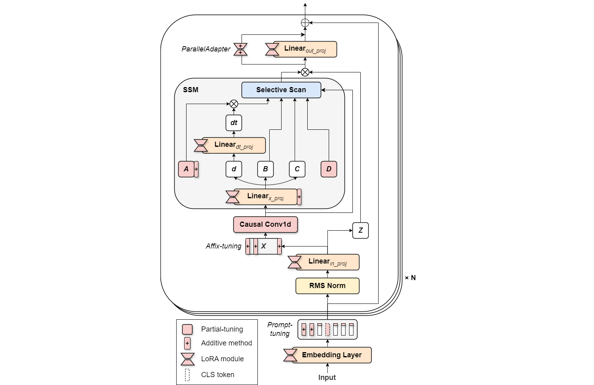
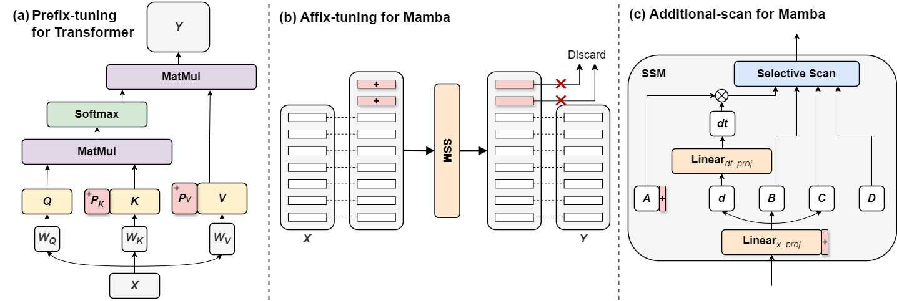

<div align="center">
<h1>MambaPEFT</h1>
<h3>[ICLR2025] MambaPEFT: Exploring Parameter-Efficient Fine-Tuning for Mamba</h3>

Homepage ([homepage](https://sony.github.io/MambaPEFT/)), arXiv Preprint ([arXiv 2411.03855](https://arxiv.org/abs/2411.03855)), ICLR 2025 ([conference paper](https://openreview.net/forum?id=UAKnJMIBwf))

</div>
this is the official implementation of MambaPEFT.  

# Abstract
An ecosystem of Transformer-based models has been established by building large models with extensive data. Parameter-efficient fine-tuning (PEFT) is a crucial technology for deploying these models to downstream tasks with minimal cost while achieving effective performance. Recently, Mamba, a State Space Model (SSM)-based model, has attracted attention as a potential alternative to Transformers. While many large-scale Mamba-based models have been proposed, efficiently adapting pre-trained Mamba-based models to downstream tasks remains unexplored. In this paper, we conduct an exploratory analysis of PEFT methods for Mamba. We investigate the effectiveness of existing PEFT methods for Transformers when applied to Mamba. We also modify these methods to better align with the Mamba architecture. Additionally, we propose new Mamba-specific PEFT methods that leverage the distinctive structure of Mamba. Our experiments indicate that PEFT performs more effectively for Mamba than Transformers. Lastly, we demonstrate how to effectively combine multiple PEFT methods and provide a framework that outperforms previous works. To ensure reproducibility, we will release the code after publication.
# Overview

- We check the availability of existing PEFT methods to Mamba
- We optimize them to Mamba with extensive exploration</li>
  <div align="center">
  
  <figcaption>An overview of our proposed MambaPEFT. We investigate, improve, and propose 20 variations of seven PEFT methods for Mamba and search for the best combination.</figcaption>
  </div>
<br>

- We propose PEFT methods specific to Mamba
  <div align="center">
  
  <figcaption>(a) Prefix-tuning designed for Transformer. It can’t be applied to Mamba. (b) The proposed Affix-tuning, which we re-design for Mamba. It discards prefixes after SSM. This design allows us to insert affix tokens at arbitrary locations. (c) Additional-scan that we design for Mamba. In this method, we add a learnable dimension to the hidden state in SSM.</figcaption>

  </div>

# Vision Experiments
### Visit [vision](vision/) directory

# Language Experiments
### Visit [language](language/commonsense_reasoning/) directory

# Citation
```
@article{yoshimura2024mambapeft,
  title={MambaPEFT: Exploring Parameter-Efficient Fine-Tuning for Mamba},
  author={Yoshimura, Masakazu and Hayashi, Teruaki and Maeda, Yota},
  journal={arXiv preprint arXiv:2411.03855},
  year={2024}
}
```